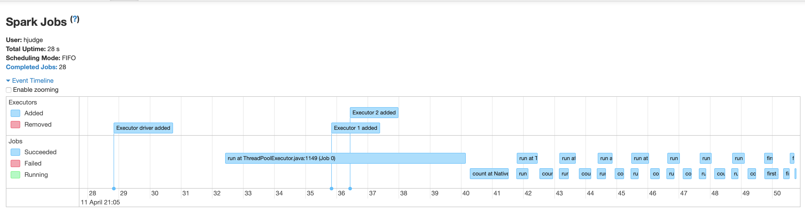
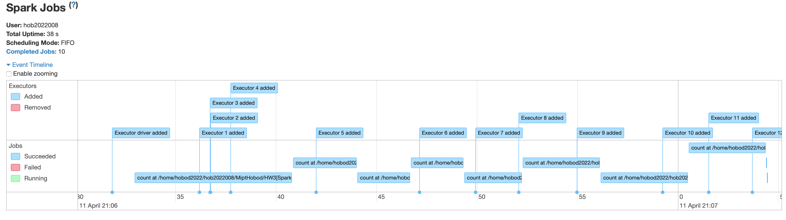
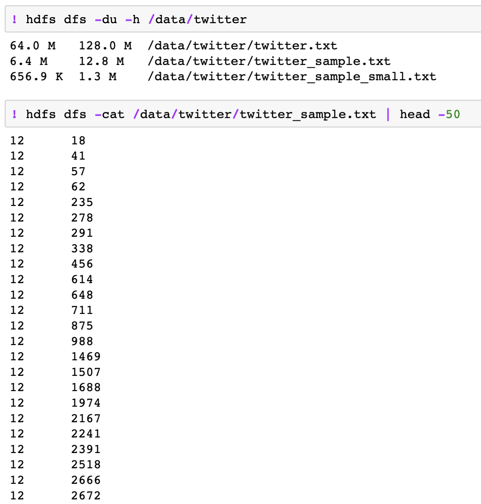

# Comparing time, Spark df vs RDD

RDD |  DF
:-------------------------:|:-------------------------:
  |  
28 seconds | 38 seconds

So, working with dataFrame is a good idea, because of speed and usability

path:
`12,422,53,52,107,20,23,274,34`

---
Here we work with twitter datasets that looks like _Adjacency graph list_:

